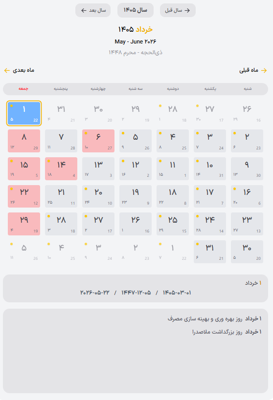

# Persian Calendar Tailwind

A modern and beautiful Jalali (Persian) calendar component for React, built with Tailwind CSS.

[](https://github.com/mehr1300/persian-calendar-tailwind)
[](https://mehr1300.github.io/persian-calendar-tailwind/)

**🔗 [Click here to view the Live Demo](https://mehr1300.github.io/persian-calendar-tailwind/)**

## Features
- Full Jalali (Persian) date support
- Modern design with Tailwind CSS
- Fully responsive and Dark Mode compatible
- Easy to use in React projects

## Installation

Using npm:
```bash
npm install persian-calendar-tailwind
```

## Usage

To use this package, first import the component and then its stylesheet into your project:

```jsx
import React from 'react';
// 1. Import the component
import { PersianCalendar } from 'persian-calendar-tailwind';
// 2. Import the calendar styles
import 'persian-calendar-tailwind/dist/style.css'; 

const App = () => {
  return (
    <div className="tw:flex tw:flex-col tw:p-20 tw:dark:bg-gray-900 tw:h-screen">
      <PersianCalendar />
    </div>
  );
};

export default App;
```

## Screenshots


---

# تقویم شمسی با تیلویند (Persian Calendar Tailwind)

یک کامپوننت تقویم شمسی (جلالی) مدرن و زیبا برای React که با استفاده از Tailwind CSS ساخته شده است.

[](https://github.com/mehr1300/persian-calendar-tailwind)
[](https://mehr1300.github.io/persian-calendar-tailwind/)

**🔗 [برای مشاهده دموی زنده کلیک کنید](https://mehr1300.github.io/persian-calendar-tailwind/)**

## ویژگی‌ها
- پشتیبانی کامل از تاریخ شمسی
- طراحی مدرن با Tailwind CSS
- کاملاً ریسپانسیو و سازگار با Dark Mode
- استفاده آسان در پروژه‌های React

## نصب

با استفاده از npm:
```bash
npm install persian-calendar-tailwind
```

## نحوه استفاده

برای استفاده از این پکیج، ابتدا کامپوننت و سپس فایل استایل آن را در پروژه خود وارد کنید:

```jsx
import React from 'react';
// ۱. ایمپورت کردن کامپوننت
import { PersianCalendar } from 'persian-calendar-tailwind';
// ۲. ایمپورت کردن استایل‌های تقویم
import 'persian-calendar-tailwind/dist/style.css'; 

const App = () => {
  return (
    <div className="tw:flex tw:flex-col tw:p-20 tw:dark:bg-gray-900 tw:h-screen">
      <PersianCalendar />
    </div>
  );
};

export default App;
```

## تصاویر (Screenshots)
